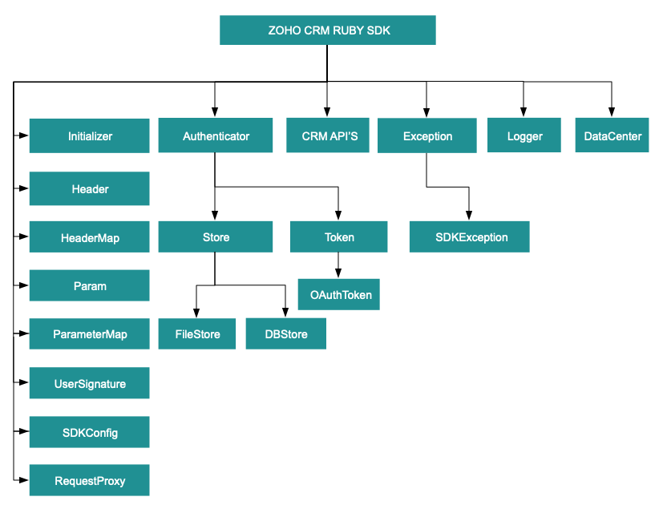

License
=======

    Copyright (c) 2021, ZOHO CORPORATION PRIVATE LIMITED 
    All rights reserved. 

    Licensed under the Apache License, Version 2.0 (the "License"); 
    you may not use this file except in compliance with the License. 
    You may obtain a copy of the License at 
    
        http://www.apache.org/licenses/LICENSE-2.0 
    
    Unless required by applicable law or agreed to in writing, software 
    distributed under the License is distributed on an "AS IS" BASIS, 
    WITHOUT WARRANTIES OR CONDITIONS OF ANY KIND, either express or implied. 
    See the License for the specific language governing permissions and 
    limitations under the License.

# ZOHO CRM RUBY SDK 8.0 for API version 8

## Table Of Contents

* [Overview](#overview)
* [Registering a Zoho Client](#registering-a-zoho-client)
* [Environmental Setup](#environmental-setup)
* [Including the SDK in your project](#including-the-sdk-in-your-project)
* [Persistence](#token-persistence)
  * [DataBase Persistence](#database-persistence)
  * [File Persistence](#file-persistence)
  * [Custom Persistence](#custom-persistence)
* [Configuration](#configuration)
* [Initialization](#initializing-the-application)
* [Class Hierarchy](#class-hierarchy)
* [Responses And Exceptions](#responses-and-exceptions)
* [Multithreading in a Multi-user App](#multithreading-in-a-multi-user-app)
* [Sample Code](#sdk-sample-code)

## Overview

Zoho CRM RUBY SDK offers a way to create client Ruby applications that can be integrated with Zoho CRM.

## Registering a Zoho Client

Since Zoho CRM APIs are authenticated with OAuth2 standards, you should register your client app with Zoho. To register your app:

- Visit this page [https://api-console.zoho.com/](https://api-console.zoho.com)

- Click on `ADD CLIENT`.

- Choose the `Client Type`.

- Enter **Client Name**, **Client Domain** or **Homepage URL** and **Authorized Redirect URIs**. Click `CREATE`.

- Your Client app will be created.

- Select the created OAuth client.

- Generate grant token by providing the necessary scopes, time duration (the duration for which the generated token is valid) and Scope Description.

## Environmental Setup

RUBY SDK requires Ruby (version 3.0 and above) to be set up in your development environment.

## Including the SDK in your project

Ruby SDK is available through Gem . You can download the gem using:
`gem install ZOHOCRMSDK8_0` 

You can include the SDK to your project using:
`require 'ZOHOCRMSDK8_0'`

### Dependencies
- Dependencies that should be included in the project
  - install **cgi**
    ```shell
      gem install cgi
    ```
  - install **csv**
    ```shell
      gem install csv
    ```
  - install **json**
    ```shell
      gem install json
    ```
  - install **multipart-post**
    ```shell
      gem install multipart-post
    ```
  - install **rest-client**
    ```shell
      gem install rest-client
    ```
  - install **uri**
    ```shell
      gem install uri
    ```
  - install **mysql2**
    ```shell
      gem install mysql2
    ```
  - install **tzinfo**
    ```shell
      gem install tzinfo
    ```
  
## Token Persistence

Token persistence refers to storing and utilizing the authentication tokens that are provided by Zoho. Token persistence enables the SDK to automatically refresh the access token after initialization using the refresh token without the need for user intervention. There are three ways provided by the SDK in which persistence can be utilized. They are DataBase Persistence, File Persistence, and Custom Persistence. Please note that the default method of token persistence provided by the Zoho CRM SDK is File persistence.

### Table of Contents

- DataBase Persistence(mysql)

- File Persistence(csv)

- Custom Persistence

### Implementing OAuth Persistence

Once the application is authorized, OAuth access and refresh tokens can be used for subsequent user data requests to Zoho CRM. Hence, they need to be persisted by the client app.

The persistence is achieved by extending the Store::TokenStore class **TokenStore**, which has the following callback methods.

- **find_token(token)** - invoked before firing a request to fetch the saved tokens. This method should return an implementation of **Token** object for the library to process it.

- **save_token(token)** - invoked after fetching access and refresh tokens from Zoho.

- **delete_token(id)** - invoked before saving the latest tokens.

- **get_tokens()** - The method to retrieve all the stored tokens.

- **delete_tokens()** - The method to delete all the stored tokens.

- **find_token_by_id(id)** - This method is used to retrieve the user token details based on unique ID.

Note:
- id is a String
- token is an instance of Token Class

### DataBase Persistence

In case the user prefers to use the default DataBase persistence, **MySQL** can be used.

- Create a table in your Database with required columns

  - id varchar(10)
  
  - user_name varchar(255)

  - client_id varchar(255)

  - client_secret varchar(255)

  - refresh_token varchar(255)

  - access_token varchar(255)

  - grant_token varchar(255)

  - expiry_time varchar(20)

  - redirect_url varchar(255)

  - api_domain varchar(255)

Note:
- Custom database name and table name can be set in DBStore instance.

#### MySQL Query

```sql
CREATE DATABASE zohooauth;
CREATE TABLE oauthtoken(
  id varchar(10) NOT NULL,
  user_name varchar(255),
  client_id varchar(255),
  client_secret varchar(255),
  refresh_token varchar(255),
  access_token varchar(255),
  grant_token varchar(255),
  expiry_time varchar(20),
  redirect_url varchar(255),
  api_domain varchar(255),
  primary key (id)
)
```

#### Create DBStore object

```ruby

# 1 -> DataBase host name. Default value "localhost"
# 2 -> DataBase name. Default  value "zohooauth"
# 3 -> DataBase user name. Default value "root"
# 4 -> DataBase password. Default value ""
# 5 -> DataBase port number. Default value "3306"

# tokenstore = ZOHOCRMSDK::Store::DBStore.new
tokenstore = ZOHOCRMSDK::Store::DBStore.new(host: "host_name", database_name: "database_name" ,table_name: "table_name",user_name: "user_name",password: "password",port_number:"port_number")
```

### File Persistence

In case of default File Persistence, the user can persist tokens in the local drive, by providing the the absolute file path to the FileStore object.

- The File contains.

  - id 

  - user_name

  - client_id

  - client_secret

  - refresh_token

  - access_token

  - grant_token

  - expiry_time

  - redirect_url

  - api_domain

#### Create FileStore object

```ruby
#Parameter containing the absolute file path to store tokens
tokenstore = ZOHOCRMSDK::Store::FileStore.new("/Users/user_name/Documents/ruby_sdk_token.txt")
```

### Custom Persistence

Users can create their own logic for storing and retrieving authentication tokens using the custom persistence technique. To use Custom Persistence, the user must extend **ZOHOCRMSDK::Store::TokenStore** and include the methods.

```ruby
require 'ZOHOCRMSDK8_0'
# This class stores the user token details to the file.
class CustomStore < ZOHOCRMSDK::Store::TokenStore
  def find_token(token)
    return nil
  end
  
  def get_tokens
    return nil
  end
  
  def save_token(token)
  end
  
  def delete_token(id)
  end
  
  def delete_tokens
  end
  
  def find_token_by_id(id)
    return nil 
  end
end
```

## Configuration

Before you get started with creating your Ruby application, you need to register your client and authenticate the app with Zoho.

| Mandatory Keys | Optional Keys |
|:---------------| :------------ |
| environment    | logger        |
| token          | store         |
|                | sdk_config    |
|                | resource_path |
----
The **environment** key contains the domain information to make API calls. The **token** key represents the OAuth info, including the clientID, clientSecret, grantToken, redirectURL, refreshToken or accessToken depending on the flow that you use. Refer to ##create an instance of OAuthToken## for more details.

- Configure the API environment which decides the domain and the URL to make API calls.

    ```ruby
    
    #Configure the environment
    #which is of the pattern DC::Domain::Environment
    #Available Domains: USDataCenter, EUDataCenter, INDataCenter, CNDataCenter, AUDataCenter
    #Available Environments: PRODUCTION, DEVELOPER, SANDBOX
    
    environment = ZOHOCRMSDK::DC::USDataCenter::PRODUCTION
    ```
- Create an instance of **ZOHOCRMSDK::Authenticator::OAuthToken** with the information that you get after registering your Zoho client. In the context of token persistence, the grant token flow and refresh token flow involve storing and persisting the token. However, the access token flow does not involve token persistence and the access token is directly utilized for API calls. Depending on the tokens available with you, choose grantToken flow, refreshToken flow or accessToken flow.

  - By default, the findUser key is set to true, to set userSignature. However, this requires the ***ZohoCRM.users.READ*** and ***ZohoCRM.org.READ*** scopes are to be mandatory. If you do not want to set userSignature, you must set the findUser key to false.

  - Use the following method for **grantToken flow :**
    ```ruby
      token = ZOHOCRMSDK::Authenticator::OAuthToken.new(client_id: "clientId", client_secret:"clientSecret", grant_token:"grant_token", redirect_url:"redirectURL", find_user: false) # by default find_user is true
    ```
  - Use the following method for **refreshToken flow :**
    ```ruby
     token = ZOHOCRMSDK::Authenticator::OAuthToken.new(client_id: "clientId", client_secret:"clientSecret", refresh_token:"refresh_token", redirect_url:"redirectURL", find_user: false) # by default find_user is true
    ```
  - Use the following method for **accessToken flow :**
    ```ruby
     token = ZOHOCRMSDK::Authenticator::OAuthToken.new(access_token:"access_token", find_user: false) # by default find_user is true
    ```
  - Use the following method for **id flow :**
    ```ruby
     token = ZOHOCRMSDK::Authenticator::OAuthToken.new(id:"id")
    ```

- Create an instance of **ZOHOCRMSDK::SDKLog::Log** Class to log exception and API information.

    ```ruby
    #
      # Create an instance of SDKLog::Log Class that takes two parameters
      # 1 -> Level of the log messages to be logged. Can be configured by typing Levels "::" and choose any level from the list displayed.
      # 2 -> Absolute file path, where messages need to be logged.
    #
    log = ZOHOCRMSDK::SDKLog::Log.initialize(level: ZOHOCRMSDK::Levels::INFO, path:"/Users/user_name/Documents/rubysdk_log.log")
    ```
- Create an instance of **[TokenStore](src/com/zoho/api/authenticator/store/token_store.rb)** to persist tokens, used for authenticating all the requests. By default, the SDK creates the sdk_tokens.txt created in the current working directory to persist the tokens.

  - Use the following method for DB Store
    ```ruby

    # 1 -> DataBase host name. Default value "localhost"
    # 2 -> DataBase name. Default  value "zohooauth"
    # 3 -> DataBase user name. Default value "root"
    # 4 -> DataBase password. Default value ""
    # 5 -> DataBase port number. Default value "3306"
    
    # tokenstore = ZOHOCRMSDK::Store::DBStore.new
    tokenstore = ZOHOCRMSDK::Store::DBStore.new(host: "host_name", database_name: "database_name" ,table_name: "table_name",user_name: "user_name",password: "password",port_number:"port_number")
    ```
  
  - Use the following method for File Store 
    ```ruby
    #Parameter containing the absolute file path to store tokens
    tokenstore = ZOHOCRMSDK::Store::FileStore.new("/Users/user_name/Documents/ruby_sdk_token.txt")
    ```
  
  - Use the following method for Custom Store
    ```ruby
    tokenStore = CustomStore.new
    ```

- Create an instance of **SDKConfig** containing the SDK configuration.

    ```ruby
    
     # By default, the SDK creates the SDKConfig instance
     # auto_refresh_fields
     # if true - all the modules' fields will be auto-refreshed in the background, every    hour.
     # if false - the fields will not be auto-refreshed in the background. The user can manually delete the file(s) or refresh the fields using methods from ModuleFieldsHandler (ZOHOCRMSDK::Util::ModuleFieldsHandler)
     #
     # pickListValidation
     # if true - value for any picklist field will be validated with the available values.
     # if false - value for any picklist field will not be validated, resulting in creation of a new value.
     #
     # open_timeout
     # Number of seconds to wait for the connection to open (default 60 seconds)
     # 
     # read_timeout
     # Number of seconds to wait for one block to be read (via one read(2) call) (default 60 seconds)
     # 
     # write_timeout
     # Number of seconds to wait for one block to be written (via one write(2) call) (default 60 seconds)
     # 
     # keep_alive_timeout
     # Seconds to reuse the connection of the previous request(default 2 seconds)
     # 

    sdk_config = ZOHOCRMSDK::SDKConfig.new(auto_refresh_fields: false, pick_list_validation: true, open_timeout: 60, read_timeout: 60, write_timeout: 60,keep_alive_timeout: 2)
    ```
- The path containing the absolute directory path to store user specific files containing module fields information. By default, the SDK stores the user-specific files within a folder in the current working directory.

    ```ruby
    resource_path = "/Users/user_name/Documents/rubysdk-application"
    ```

## Initializing the Application

Initialize the SDK using the following code.

```ruby
require 'ZOHOCRMSDK8_0'

class Initialize
    def self.initialize() 
      
        log = ZOHOCRMSDK::SDKLog::Log.initialize(level:ZOHOCRMSDK::Levels::INFO,path:"/Users/user_name/Documents/rubysdk_log.log")
        environment = ZOHOCRMSDK::DC::USDataCenter.PRODUCTION
        token = ZOHOCRMSDK::Authenticator::OAuthToken.new(client_id: "clientId", client_secret:"clientSecret", grant_token:"grant_token", redirect_url:"redirectURL")
        tokenstore = ZOHOCRMSDK::Store::DBStore.new(host: "host_name", database_name: "database_name" ,table_name: "table_name",user_name: "user_name",password: "password",port_number:"port_number")
        #tokenstore = ZOHOCRMSDK::Store::FileStore.new("/Users/user_name/Documents/ruby_sdk_token.txt"
        sdk_config = ZOHOCRMSDK::SDKConfig.new(auto_refresh_fields: false,pick_list_validation: true,open_timeout: 60,read_timeout: 60,write_timeout: 60,keep_alive_timeout: 2)
        resource_path = "/Users/user_name/Documents/rubysdk-application"
        
        # The initialize method of Initializer class that takes the following arguments
        # 1 -> Environment instance
        # 2 -> Token instance
        # 3 -> TokenStore instance
        # 4 -> SDKConfig instance
        # 5 -> resourcePath -A String
        # 6 -> Log instance (optional)

        #The following is the initialize method

        ZOHOCRMSDK::Initializer.initialize(environment: environment, token: token, store: tokenstore, sdk_config: sdk_config, resources_path: resource_path,log:log,nil)
    end
end

```

- You can now access the functionalities of the SDK. Refer to the sample codes to make various API calls through the SDK.

## Class Hierarchy



## Responses and Exceptions

All SDK method calls return an instance of the **APIResponse** class.

Use the **data_object** to get the returned **APIResponse** object to obtain the response handler interface depending on the type of request (**GET, POST,PUT,DELETE**).

**APIResponse&ltResponseHandler&gt** and **APIResponse&ltActionHandler&gt** are the common wrapper objects for Zoho CRM APIs’ responses.

Whenever the API returns an error response, the response will be an instance of **APIException** class.

All other exceptions such as SDK anomalies and other unexpected behaviours are thrown under the **SDKException** class.

- For operations involving records in Tags
  - **APIResponse&ltRecordActionHandler&gt**

- For getting Record Count for a specific Tag operation
  
  - **APIResponse&ltCountHandler&gt**

- For operations involving BaseCurrency

  - **APIResponse&ltBaseCurrencyActionHandler&gt**

- For Lead convert operation

  - **APIResponse&ltConvertActionHandler&gt**

- For retrieving Deleted records operation

  - **APIResponse&ltDeletedRecordsHandler&gt**

- For  Record image download operation

  - **APIResponse&ltDownloadHandler&gt**

- For MassUpdate record operations

  - **APIResponse&ltMassUpdateActionHandler&gt**

  - **APIResponse&ltMassUpdateResponseHandler&gt**

### GET Requests

- The **data_object** variable of the returned APIResponse instance returns the response handler interface.

- Most of the APIs follows the **Common** Structure as below.

  - The **ResponseHandler class** encompasses the following
  - **ResponseWrapper class** (for **application/json** responses)
  - **FileBodyWrapper class** (for File download responses)
  - **APIException class**


- Some of the APIs follow the **Particular** Structure as below.

  - The **ResponseHandler class** encompasses the following
  - The **ResponseHandler interface** encompasses the following
    - **HistoryWrapper class** (for **application/json** responses in **backup** API, holds the list of instances of **History class** and instance of **Info class**)
    - **UrlsWrapper class** (for **application/json** responses in **backup** API, holds the instance of **Urls class**)
    - **SourcesCountWrapper class** (for **application/json** responses in **UserGroups** API, holds the List of instances of **SourceCount class**)
    - **SourcesWrapper class** (for **application/json** responses in **Usergroups** APi, holds the List of instances of **Sources class** and instance of **Info class**)


- The **ResponseWrapper class** in **BulkWrite** API encompasses the following
  - **BulkWriteResponse class** (for **application/json** responses)
  - **APIException class**

- The **CountHandler class** encompasses the following
  - **CountWrapper class** (for **application/json** responses in **Record** API, holds the Long **count**)
  - **APIException class**

- The **DeletedRecordsHandler class** encompasses the following
  - **DeletedRecordsWrapper class** (for **application/json** responses in **Record** API, holds the list of instances of **DeletedRecord class** and instance of **Info class**)
  - **APIException class**

- The **DownloadHandler class** encompasses the following
  - **FileBodyWrapper class** (for File download responses)
  - **APIException class**

- The **MassUpdateResponseHandler class** encompasses the following
  - **MassUpdateResponseWrapper class** (for **application/json** responses in **Record** API, holds the list of instances of **MassUpdateResponse class**)
  - **APIException class**

- The **MassUpdateResponse class** encompasses of following
  - **MassUpdate class** (for **application/json** responses)
  - **APIException class**

- The **ValidationHandler class** in **UserTerritories** API encompasses the following
  - **ValidationWrapper class** (for **application/json** responses, holds the list of instances of **ValidationGroup class**)
  - **APIException class**

- The **ValidationGroup class** in **UserTerritories** API encompasses the following
  - **Validation class**
  - **BulkValidation class**


### POST, PUT, DELETE Requests

- The **data_object** variable of the returned APIResponse instance returns the action handler interface.

- Most of the APIs follows the **Common** Structure as.

  - The **ActionHandler class** encompasses the following
    - **ActionWrapper class** (for **application/json** responses)
    - **APIException class**

  - The **ActionWrapper class** contains **Property/Properties** that may contain one/list of **ActionResponse class**.

  - The **ActionResponse class** encompasses the following
    - **SuccessResponse class** (for **application/json** responses)
    - **APIException class**

- Some of the APIs follow the **Particular** Structure as.

  - The **ActionHandler class** encompasses the following
    - **ActionWrapper class** (for **application/json** responses)
    - **APIException class**

  - The **ActionWrapper class** contains **Property/Properties** that may contain one/list of **ActionResponse class**.

  - The **ActionResponse class** encompasses the following
    - **BusinessHoursCreated class** (for **application/json** responses in **BusinessHours** API)
    - **MassDeleteScheduled class** (for **application/json** responses in **MassDeleteCVID** API)
    - **APIEXception class**

  - The **RecordActionHandler class** encompasses the following
    - **RecordActionWrapper class** (for **application/json** responses in **Tags** API, holds the list of instance of **RecordActionResponse class**, Boolean **wfScheduler**, String **successCount** and Boolean **lockedCount**)
    - **APIException class**

  - **RecordActionResponse class** encompasses the following
    - **RecordSuccessResponse class** (for **application/json** responses)
    - **APIException class**

  - The **ActionHandler class** in **Currencies** API encompasses the following
    - **BaseCurrencyActionWrapper class** (for **application/json** responses)
    - **APIException class**

  - The **BaseCurrencyActionWrapper class** contains **Property/Properties** that contain **BaseCurrencyActionResponse class**.

  - The **BaseCurrencyActionResponse class** encompasses the following
    - **SuccessResponse class** (for **application/json** responses)
    - **APIException class**

  - The **MassUpdateActionHandler class** encompasses the following
    - **MassUpdateActionWrapper class** (for **application/json** responses in **Record** API, holds the list of instances of **MassUpdateActionResponse class**)
    - **APIException class**

  - The **MassUpdateActionResponse class** encompasses of following
    - **MassUpdateSuccessResponse class** (for **application/json** responses)
    - **APIException class**

  - The **FileHandler class** in **Record** API encompasses the following
    - **SuccessResponse class** (for **application/json** responses)
    - **APIException class**

  - The **SignActionHandler class** in **MailMerge** API encompasses the following
    - **SignActionWrapper class** (for **application/json** responses)
    - **APIException class**

  - The **DeleteActionHandler class** encompasses the following
    - **DeleteActionWrapper class** (for **application/json** responses in **ShareRecords** API, holds the instance of **DeleteActionResponse class**)
    - **APIException class**
  - The **DeleteActionResponse class** encompasses the following
    - **SuccessResponse class** (for **application/json** responses)
    - **APIException class**

  - The **TransferActionHandler class** in **UserTerritories** API encompasses the following
    - **TransferActionWrapper class** (fro **application/json** responses , holds the list of instances of **TransferActionResponse class**)

  - The **TransferActionResponse class** encompasses the following
    - **SuccessResponse class** (for **application/json** responses)
    - **APIException class**

  - The **ActionResponse class** in **Territories** API encompasses the following
    - **Success class** (for **application/json** responses)
    - **APIException class**

  - The **TransferPipelineActionHandler class** in **Pipeline** API encompasses the following
    - **TransferPipelineActionWrapper class** (for **application/json** responses, holds the list of insatnces of **TransferPipelineActionResponse class**)
    - **APIException class**

  - The **TransferPipelineActionResponse class** in **Pipeline** API encompasses the following
    - **TransferPipelineSuccessResponse class** (for **application/json** responses)
    - **APIException class**

## Threading in the Ruby SDK

Threads in a Ruby program help you achieve parallelism. By using multiple threads, you can make a Ruby program run faster and do multiple things simultaneously.

### Multithreading in a Multi-user App

Multi-threading for multi-users is achieved using Initializer's static **switch_user()**.
switch_user() takes the value initialized previously for enviroment, token and sdk_config incase None is passed (or default value is passed).
```ruby
ZOHOCRMSDK::Initializer.switch_user(environment:environment, token:token, sdk_config:sdk_config)
```

Here is a sample code to depict multi-threading for a multi-user app.

```ruby
require 'ZOHOCRMSDK8_0'
module MultiUser
    class MultiThreading
        def initialize(module_api_name)
            @module_api_name = module_api_name
        end
        def execute(environment, token, tokenstore, sdk_config,resources_path, log)
            ZOHOCRMSDK::Initializer.initialize(environment: environment, token: token, store: tokenstore, sdk_config: sdk_config, resources_path: resources_path,log:log,nil)
            token1 = ZOHOCRMSDK::Authenticator::OAuthToken.new(client_id: "clientId", client_secret:"clientSecret", grant_token:"grant_token", refresh_token:"refresh_token", redirect_url:"redirectURL", id:"id")
            environment1 = ZOHOCRMSDK::DC::USDataCenter::PRODUCTION
            sdk_config1 = ZOHOCRMSDK::SDKConfig.new(auto_refresh_fields: false,pick_list_validation: true,open_timeout: 60,read_timeout: 60,write_timeout: 60,keep_alive_timeout: 2)
            t1 = Thread.new{func1(environment1, token1, sdk_config1)}
            token2 = ZOHOCRMSDK::Authenticator::OAuthToken.new(client_id: "clientId", client_secret:"clientSecret", grant_token:"grant_token", refresh_token:"refresh_token", redirect_url:"redirectURL", id:"id")
            environment2 = ZOHOCRMSDK::DC::USDataCenter::PRODUCTION
            sdk_config2 = ZOHOCRMSDK::SDKConfig.new(auto_refresh_fields: false,pick_list_validation: true,open_timeout: 60,read_timeout: 60,write_timeout: 60,keep_alive_timeout: 2)
            t2 = Thread.new{func1(environment2, token2, sdk_config2)}
            t1.join
            t2.join
        end
        def func1(environment, token, sdk_config)
            ZOHOCRMSDK::Initializer.switch_user(environment:environment, token:token, sdk_config:sdk_config)
            print ZOHOCRMSDK::Initializer.get_initializer.user.email
            ro = ZOHOCRMSDK::Record::RecordOperations.new
            param_instance = ZOHOCRMSDK::ParameterMap.new
            param_instance.add(ZOHOCRMSDK::Record::RecordOperations::GetRecordsParam.fields, "id")
            ro.get_records(@module_api_name,param_instance,nil)   
        end
    end
end
log = ZOHOCRMSDK::SDKLog::Log.initialize(level:ZOHOCRMSDK::Levels::INFO,path:"/Users/user_name/Documents/rubysdk_log.log")
environment = ZOHOCRMSDK::DC::USDataCenter::PRODUCTION
token = ZOHOCRMSDK::Authenticator::OAuthToken.new(client_id: "clientId", client_secret:"clientSecret", grant_token:"grant_token", refresh_token:"refresh_token", redirect_url:"redirectURL")
tokenstore = ZOHOCRMSDK::Store::FileStore.new("/Users/user_name/Documents/ruby_sdk_token.txt")
sdk_config = ZOHOCRMSDK::SDKConfig.new(auto_refresh_fields: false,pick_list_validation: true,open_timeout: 60,read_timeout: 60,write_timeout: 60,keep_alive_timeout: 2)
module_api_name = "Leads"
resource_path = "/Users/user_name/Documents"
MultiUser::MultiThreading.new(module_api_name).execute(environment, token, tokenstore, sdk_config,resource_path, log)
```
- The program execution starts from **execute()**.

- The details of **"user1"** are given in the variables token1, environment1.

- Similarly, the details of another user **"user2"** are given in the variables token2, environment2.

- For each user, an instance of **MultiThreading class** is created.

- When **t1.join** is called which in-turn invokes the **thread** which has the details of user1 are passed to the **switch_user** function through the **func1()**. Therefore, this creates a thread for user1.

- Similarly, When the **t2.join** is invoked ,  the details of user2 are passed to the switch_user function through the **func1()**. Therefore, this creates a thread for user2.

### Multi-threading in a Single User App

```ruby

require 'ZOHOCRMSDK8_0'
module SingleUser
  class MultiThreading
    def execute(environment, token, tokenstore, sdk_config, resources_path, log)
      ZOHOCRMSDK::Initializer.initialize(environment: environment, token: token, store: tokenstore, sdk_config: sdk_config, resources_path: resources_path, log:log)
      t1 = Thread.new{func1("Leads")}
      t2 = Thread.new{func1("Deals")}
      t1.join
      t2.join
    end
    def func1(module_api_name)
      ro = ZOHOCRMSDK::Record::RecordOperations.new(module_api_name)
      param_instance = ZOHOCRMSDK::ParameterMap.new
      param_instance.add(ZOHOCRMSDK::Record::RecordOperations::GetRecordsParam.fields, "id")
      response = ro.get_records(param_instance,nil)
    end

  end
end
log = ZOHOCRMSDK::SDKLog::Log.initialize(level:ZOHOCRMSDK::Levels::INFO,path:"/Users/rubysdk_log.log")
environment = ZOHOCRMSDK::DC::USDataCenter::PRODUCTION
token = ZOHOCRMSDK::Authenticator::OAuthToken.new(client_id: 'client_id', client_secret: 'client_secret', refresh_token: 'refresh_token')
tokenstore = ZOHOCRMSDK::Store::FileStore.new("/Users/sdk_tokens.txt")
sdk_config = ZOHOCRMSDK::SDKConfig.new(auto_refresh_fields: false,pick_list_validation: true,open_timeout: 60,read_timeout: 60,write_timeout: 60,keep_alive_timeout: 2)
resource_path = "/Users/sample-application"
SingleUser::MultiThreading.new.execute(environment, token, tokenstore, sdk_config, resource_path, log)
```
- The program execution starts from **execute()**. where the SDK is initialized with the details of user and an instance of **MultiThreading class** is created .

- When the **t1.join** is called which in-turn invokes the **func1()**,  the module_api_name is switched through the **MultiThreading** object. Therefore, this creates a thread for the particular operation

- Similarly, When the **t2.join** is invoked ,  the module_api_name is switched through the **MultiThreading** object. Therefore, this creates a thread for the particular operation

## SDK Sample code

```ruby
require 'ZOHOCRMSDK8_0'

class CreateRecords
  def self.create_records(module_api_name)
    begin
        record_operations = ZOHOCRMSDK::Record::RecordOperations.new(module_api_name)
        body_wrapper = ZOHOCRMSDK::Record::BodyWrapper.new
        records = []
        record1 = ZOHOCRMSDK::Record::Record.new
        record1.add_field_value(ZOHOCRMSDK::Record::Field::Leads.Last_name, "Last Name")
        record1.add_field_value(ZOHOCRMSDK::Record::Field::Leads.First_name, "First Name")
        record1.add_field_value(ZOHOCRMSDK::Record::Field::Leads.Company, "Company Name")
        record1.add_field_value(ZOHOCRMSDK::Record::Field::Leads.Annual_revenue, 1221.2)
        record1.add_field_value(ZOHOCRMSDK::Record::Field::Leads.Lead_status, ZOHOCRMSDK::Util::Choice.new("Not Contacted"))
        records.push(record1)
        body_wrapper.data = records
        header_instance = ZOHOCRMSDK::HeaderMap.new
        response = record_operations.create_records(body_wrapper, header_instance)
        if response != nil
        print("status code: " + response.status_code.to_s + "\n")
        if response.is_expected
            action_handler = response.data_object
            if  action_handler.is_a? ZOHOCRMSDK::Record::ActionWrapper
            action_wrapper =  action_handler
            action_responses = action_wrapper.data
            action_responses.each do |action_response|
                if  action_response.is_a? ZOHOCRMSDK::Record::SuccessResponse
                success_response =  action_response
                print("status: " + success_response.status.value.to_s + "\n")
                print("code: " + success_response.code.value.to_s + "\n")
                print("details: ".to_s + "\n")
                success_response.details.each do |k, v|
                    print k + ":"
                    print v
                    print "\n"
                end
                print("message: " + success_response.message.value.to_s + "\n")
                elsif  action_response.is_a? ZOHOCRMSDK::Record::APIException
                exception =  action_response
                print("status: " + exception.status.value.to_s + "\n")
                print("code: " + exception.code.value.to_s + "\n")
                print("details: ".to_s + "\n")
                exception.details.each do |k, v|
                    print k + ":"
                    print v
                    print "\n"
                end
                print("message: " + exception.message.value.to_s + "\n")
                end
            end
            elsif  action_handler.is_a? ZOHOCRMSDK::Record::APIException
            exception =  action_handler
            print("status: " + exception.status.value.to_s + "\n")
            print("code: " + exception.code.value.to_s + "\n")
            print("details: ".to_s + "\n")
            exception.details.each do |k, v|
                print k + ":"
                print v
                print "\n"
            end
            print("message: " + exception.message.value.to_s + "\n")
            end
        else
            response_object = response.data_object
            response_object.instance_variables.each do |field|
            print field
            print '\n'
            print response_object.instance_variable_get(field)
            end
        end
        end
    rescue StandardError => e
        print(e)
    end
  end
  def self.initialize_and_call
    environment = ZOHOCRMSDK::DC::USDataCenter::PRODUCTION
    token = ZOHOCRMSDK::Authenticator::OAuthToken.new(client_id: 'client_id', client_secret: 'client_secret', grant_token: 'grant_token')
    ZOHOCRMSDK::Initializer.initialize(environment: environment, token: token, log:log)
    module_api_name = "Leads"
    create_records(module_api_name)
  end
end
CreateRecords.initialize_and_call
```
